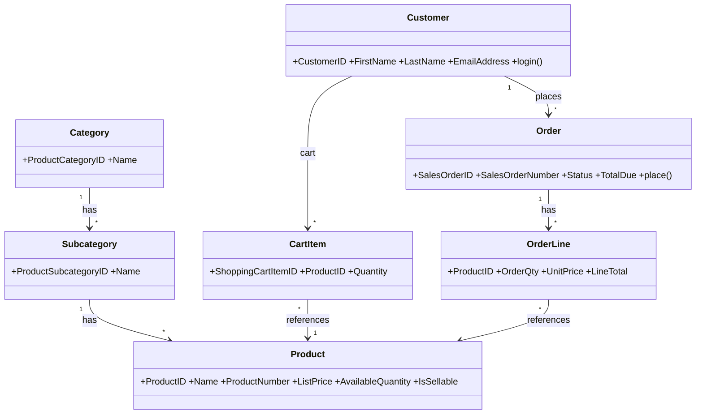

# Requirements: AdventureWorks Online Store

**Domain:** Retail / E-commerce — cycle-sports catalogue (AdventureWorks 2019) **Created:** 2026-07-22 **Status:** draft (planning only)

---

## 1. Application context

**Name:** AdventureWorks Online Store

**Purpose / business value:** Turn the existing AdventureWorks 2019 operational database into a working online store: let Customers browse the catalogue, build a cart, and place orders; let Admins keep the catalogue and stock current and move orders through fulfilment.

**Domain:** Retail e-commerce (bikes, components, clothing, accessories). Currency USD; North-American address conventions.

**Business goal:** Every placed order is captured with correct, time-of-sale-priced line items and reduces available stock, while Customers and Admins operate on cleanly separated surfaces.

---

## 2. Domain model

### 2.1 Concepts
| Concept | Persistence | Definition |
|---------|-------------|------------|
| Product | persistent | A sellable catalogue item with price, classification, and stock. |
| Category / Subcategory | persistent | Two-level classification of products. |
| Cart Item | persistent | A line in a customer's pre-checkout cart. |
| Order | persistent | A placed sales order with header totals and line items. |
| Order Status | derived | Lifecycle position of an order gating admin actions. |
| Customer | persistent | The buyer, identified by email; carries orders. |

### 2.2 Relationships
- **Category** *has* **Subcategories** [1 : *]; **Subcategory** *has* **Products** [1 : *]
- **Customer** *has* **Cart** *of* **Cart Items** [1 : *]
- **Customer** *places* **Orders** [1 : *]; **Order** *has* **Order Lines** [1 : *]
- **Cart Item** / **Order Line** *reference* **Product** [* : 1]

### 2.3 Lifecycles
- **Order:** `In process (1)` → `Approved (2)` → `Shipped (5)`; branches `Backordered (3)`, `Rejected (4)`, `Cancelled (6)`. Terminal: Shipped, Rejected, Cancelled.
- **Product:** `Sellable` → `Discontinued` (soft; remains in historical orders).

### 2.4 Diagram

---

## 3. Target users

### Customer
Shopper who browses, carts, and buys. Non-technical; expects fast browse/filter, clear stock/price, and a frictionless cart→checkout. Fears: buying an out-of-stock item, unclear totals at checkout.

### Admin
Store operator. Domain-fluent; keeps the catalogue accurate, adjusts stock, and moves orders through fulfilment. Fears: overselling stock, orders stuck without a valid next status, editing the wrong record.

---

## 4. Functional requirements (front-end)

- F-01 Email+password login routes to a role landing (Customer → Catalog; Admin → Products).
- F-02 Catalog lists sellable products with category/subcategory filter, text search, price-range filter, sort, and paging.
- F-03 Product detail shows price, description, colour/size, and availability; "Add to Cart" adds a unit.
- F-04 Cart lists lines with unit price, editable quantity (capped at available stock), line total, and running subtotal; supports remove and clear.
- F-05 Checkout shows order summary, ship-to address and ship-method selectors, computed Tax/Freight/Total, and a Place-Order action; success shows the new order number.
- F-06 A dedicated **My Orders** page lists the customer's own orders (number, date, total, status) with status/date filters, sort, and paging; opening an order shows its lines, ship-to, ship method, and totals (read-only status). Reached from the customer nav and the Checkout confirmation.
- F-07 Admin Product Management lists products (incl. inactive), with create, edit, discontinue, and inventory-adjust.
- F-08 Admin Order Management lists all orders with status/customer/date filters; order detail shows lines/totals; status control offers only valid next transitions.
- F-09 Admin Customer Management lists customers with search; customer detail shows profile + order history; edit updates contact details.
- F-10 All tables paginate (5/10/20/50, default 20) and support single-column sort.

## 4.1 Business rules (UI enforcement)
| ID | Statement | Source |
|----|-----------|--------|
| BR-01 | Add-to-cart and quantity increases are blocked beyond the product's available stock. | → §2.3; BRD BR-02 |
| BR-02 | Checkout is disabled when the cart is empty. | → BRD BR-03 |
| BR-03 | The order status control shows only valid next transitions; terminal orders show no status action. | → BRD BR-06 |
| BR-04 | Customer surfaces never render admin actions; Admin surfaces never render cart/checkout. Denied actions are hidden, not disabled. | → §6 RBAC |
| BR-05 | A customer can only see their own orders; direct-linking another order shows a permission-denied banner. | → BRD BR-08 |
| BR-06 | Placing an order shows a confirmation with the order number and clears the cart badge. | → BRD BR-05 |

---

## 5. RBAC matrix

**Action vocabulary:** `C` create · `R` read · `U` update · `X` execute · `A` advance-status · `—` no access.

| Role | Product (catalog) | Product (admin CRUD) | Inventory | Cart | Order (own) | Order (all) | Order status | Customer |
|------|-------------------|----------------------|-----------|------|-------------|-------------|--------------|----------|
| Customer | R | — | — | C R U D | C R | — | — | R (self) |
| Admin | R | C R U D(soft) | U | — | R | R | A | R U |

> Notes: Customer cart/orders are scoped to the authenticated `CustomerID`. Admin has no shopping surface. Denied actions are hidden in the UI and rejected (403) by the backend.

---

## 6. Data entities (implementation-prep)

### Entity: Product
| Field | Type | Required | Notes |
|-------|------|----------|-------|
| ProductID | integer | yes | PK, system-assigned. |
| Name | string | yes | max 50. |
| ProductNumber | string | yes | unique; max 25. |
| ListPrice | number | yes | ≥ 0, 2dp. |
| StandardCost | number | yes | ≥ 0. |
| Color / Size | string | no | |
| SubcategoryId | integer | yes | FK → ProductSubcategory. |
| AvailableQuantity | integer | derived | Σ ProductInventory.Quantity. |
| IsSellable | boolean | derived | per BRD BR-01. |

### Entity: Order
| Field | Type | Required | Notes |
|-------|------|----------|-------|
| SalesOrderID | integer | yes | PK. |
| SalesOrderNumber | string | derived | computed display ref. |
| OrderDate / ShipDate | datetime | OrderDate yes | ShipDate set on Shipped. |
| Status | enum(1–6) | yes | see lifecycle. |
| CustomerID | integer | yes | FK. |
| SubTotal / TaxAmt / Freight | number | yes | computed at placement. |
| TotalDue | number | derived | computed column. |
| Lines | OrderLine[] | yes | ≥ 1. |

### Entity: OrderLine
| Field | Type | Required | Notes |
|-------|------|----------|-------|
| ProductID | integer | yes | FK. |
| OrderQty | integer | yes | > 0. |
| UnitPrice | number | yes | price snapshot at checkout. |
| LineTotal | number | derived | computed column. |

### Entity: Customer
| Field | Type | Required | Notes |
|-------|------|----------|-------|
| CustomerID | integer | yes | PK. |
| FirstName / LastName | string | yes | via Person.Person. |
| EmailAddress | string | yes | via Person.EmailAddress; login id. |
| AccountNumber | string | derived | computed. |

---

## 7. Non-functional (inherited from BRD §10)
- Security: cookie JWT session, SHA-512 passwords, Customer/Admin RBAC, cart/order ownership isolation.
- Performance: storefront read p95 ≤ 2 s; lists paged.
- Accessibility: WCAG 2.2 AA; status chips pair colour with label; keyboard-first primary flows.

---

## Prototype invariants
- **PI-01** Server behaviour is simulated by client-side stubs unless the backend is running.
- **PI-02** Data is fixture-backed from the AdventureWorks-shaped mock data / OpenAPI examples.
- **PI-03** Validation is visual; server-side constraints (uniqueness, stock, ownership) are described, not enforced, in the prototype.
- **PI-04** Payment/email/shipping integrations are visual placeholders (no external calls).
- **PI-05** A chrome-level role switcher (Customer/Admin) lets reviewers inspect each role without re-authenticating.
