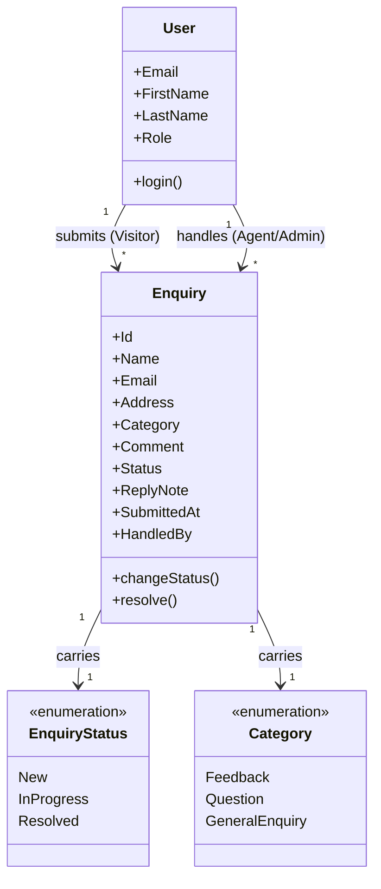

# Requirements: Contact & Enquiry Management

**Domain:** Customer support — public enquiry capture and back-office triage **Created:** 2026-07-23 **Status:** final

---

## 1. Application context

**Name:** Contact & Enquiry Management

**Purpose / business value:** Let a **Visitor** send a contact enquiry (name, email, optional address, a category, and a comment) and receive immediate confirmation, while giving back-office staff a triage surface: a **Support Agent** works enquiries through a status lifecycle, and an **Admin** additionally curates the inbox (delete spam, reassign). A single public form feeds a role-gated review workflow.

**Domain:** Generic customer-support / contact-us, applicable to any organisation that fields public enquiries.

**Business goal:** Capture every enquiry with a confirmed hand-off, and ensure each one reaches a terminal, auditable state (Resolved with a reply note) without a Visitor ever seeing another person's enquiry or the back-office surfaces.

---

## 2. Domain model

> The business domain in **ubiquitous language**, implementation-free.

### 2.1 Concepts

| Concept          | Persistence | Definition (ubiquitous language) |
| ---------------- | ----------- | -------------------------------- |
| Enquiry          | persistent  | A contact message submitted by a Visitor, carrying contact details, a category, a comment, and its handling state. |
| User             | persistent  | An authenticated actor of the system, identified by email and bearing one of the system's roles. |
| Enquiry Status   | derived     | The lifecycle position of an Enquiry — `New`, `In Progress`, or `Resolved` — that gates the actions back-office roles may take. |
| Category         | enum        | The nature of an Enquiry as chosen by the Visitor — `Feedback`, `Question`, or `General Enquiry`. |
| Reply Note       | attribute   | The free-text response captured by a back-office role when an Enquiry is moved to `Resolved`. |

### 2.2 Relationships

- **User** *submits* **Enquiry** [1 : *] — Visitor only
- **User** *handles* **Enquiry** [1 : *] — Support Agent / Admin only
- **Enquiry** *carries* **Enquiry Status** [1 : 1]
- **Enquiry** *carries* **Category** [1 : 1]

### 2.3 Aggregates & lifecycles

#### Enquiry

| Field            | Value |
| ---------------- | ----- |
| Member concepts  | Enquiry, Enquiry Status, Category, Reply Note |
| Lifecycle states | `New` → `In Progress` → `Resolved` — terminal state is `Resolved`; once terminal, status does not change. |
| Key invariants   | Status-change actions are available only while the Enquiry is non-terminal. Moving an Enquiry to `Resolved` requires a non-empty Reply Note. A Visitor may read only Enquiries they submitted. |

### 2.4 Diagram

---

## 3. Target users

### Visitor

| Field | Value |
| ----- | ----- |
| Role / job title | A member of the public contacting the organisation. |
| Expertise level | None assumed — first-time, occasional user. |
| Stakes | Low, but wants confidence the message was received. |
| Frequency of use | Rare / one-off. |
| Driving forces — wants | A short form, clear confirmation that the message sent, a record of what they submitted. |
| Driving forces — fears | Submitting into a void; not knowing if it went through; losing what they typed. |

### Support Agent

| Field | Value |
| ----- | ----- |
| Role / job title | Front-line support staff who read and resolve incoming enquiries. |
| Expertise level | Comfortable with an inbox / ticket-list workflow. |
| Stakes | Medium — a mishandled or lost enquiry is a poor customer experience. |
| Frequency of use | Daily — works the inbox throughout the day. |
| Driving forces — wants | Fast triage; filter by category and status; a frictionless resolve-with-note path. |
| Driving forces — fears | Missing an enquiry; resolving without a recorded reply; losing context across many enquiries. |

### Admin

| Field | Value |
| ----- | ----- |
| Role / job title | Support lead responsible for inbox hygiene and oversight. |
| Expertise level | Domain-fluent; trusted with destructive actions. |
| Stakes | High for delete — removal is irreversible. |
| Frequency of use | Occasional — curation rather than day-to-day triage. |
| Driving forces — wants | Everything an Agent can do, plus removing spam/duplicates cleanly. |
| Driving forces — fears | Deleting a legitimate enquiry by accident. |

---

## 4. User goals & stories

### 4.1 Goals catalogue

| ID   | Goal statement | Quality signals | Goal kind | Layout pref | UX-pattern pref |
| ---- | -------------- | --------------- | --------- | ----------- | --------------- |
| G-01 | Send an enquiry and be sure it was received. | Confidence of completion; visible confirmation; form resets. | top-level | Single-form contact screen | Validated form → confirmation page + success toast |
| G-02 | Review what I submitted. | Recall of my own enquiries; read-only clarity. | sub-level | Simple list of my submissions | Read-only cards / table, own-records only |
| G-03 | Triage incoming enquiries and drive each to resolution. | Speed of triage; auditability of the reply; terminal-state clarity. | top-level | Inbox table-first surface | Filterable/sortable table with status actions |
| G-04 | Find a specific enquiry by category, status, or text. | Recall + precision; clearable filters. | sub-level | Filter bar above the inbox | Category/status chips + free-text search |
| G-05 | Keep the inbox clean by removing spam or duplicates. | Safety (confirm before delete); admin-only. | interaction-level | Row action on the inbox | Destructive-confirm modal |
| G-06 | Sign in to the right surface for my role. | One step; failure feedback. | top-level | Single login screen | Email + password with role-based routing |

### 4.2 Stories by persona

#### Visitor

- **As a Visitor, I want to submit an enquiry (name, email, optional address, category, comment), so that I can contact the organisation.** → G-01
- **As a Visitor, I want a confirmation page showing what I sent, with the form cleared and a "Message sent!" message, so that I know it went through.** → G-01
- **As a Visitor, I want to see the enquiries I have submitted (read-only, mine only), so that I can check what I sent.** → G-02
- **As a Visitor, I want to sign in and land on the contact surface, so that I don't see back-office screens.** → G-06

#### Support Agent

- **As a Support Agent, I want a sortable, filterable, paginated inbox of all enquiries, so that I can work them in order.** → G-03
- **As a Support Agent, I want to open an enquiry and move it New → In Progress, so that I can show I've picked it up.** → G-03
- **As a Support Agent, I want to resolve an enquiry with a mandatory reply note, so that the resolution is auditable.** → G-03
- **As a Support Agent, I want to filter the inbox by category, status, or free text, so that I can find an enquiry quickly.** → G-04
- **As a Support Agent, I want to sign in and land on the inbox, so that I start where my work is.** → G-06

#### Admin

- **As an Admin, I want everything a Support Agent can do, so that I can triage as well as oversee.** → G-03
- **As an Admin, I want to delete an enquiry behind a confirmation, so that I can remove spam without leaving clutter.** → G-05

---

## 5. Task flows

### Flow: Authentication

| Field | Value |
| ----- | ----- |
| Actor | Visitor, Support Agent, or Admin |
| Trigger | User opens the application unauthenticated. |
| Steps | 1. Enter email + password. 2. Submit. 3. On success, route to the role's landing surface (Visitor → Contact form; Agent/Admin → Inbox). 4. On failure, inline error distinguishing credentials from connectivity. |
| Role-conditional behaviour | Post-login routing differs by role per §3. |

### Flow: Submit Enquiry

| Field | Value |
| ----- | ----- |
| Actor | Visitor |
| Trigger | Visitor wants to contact the organisation. |
| Steps | 1. Open the Contact form. 2. Enter Name, Email, optional Address, choose a Category, enter a Comment. 3. Submit. 4. System creates an Enquiry in `New`. 5. Route to a confirmation page echoing the submitted details; the form is cleared; a "Message sent!" confirmation shows. |
| Decision points | All required fields valid → submit succeeds. Any invalid → inline validation, submit blocked. |
| Exception paths | Email malformed → inline error. Comment empty / too short → inline error. |
| Role-conditional behaviour | Visitor-only — Agent/Admin do not see the public form in their navigation. |

### Flow: My Submissions

| Field | Value |
| ----- | ----- |
| Actor | Visitor |
| Trigger | Visitor wants to review enquiries they sent. |
| Steps | 1. Open "My messages". 2. See a read-only list of **their own** enquiries with category, status, and submitted date. |
| Exception paths | No submissions → entity-specific empty state ("You haven't sent any messages yet") with a link to the Contact form. |
| Role-conditional behaviour | A Visitor sees only Enquiries they submitted; never anyone else's. |

### Flow: Inbox

| Field | Value |
| ----- | ----- |
| Actor | Support Agent or Admin |
| Trigger | Back-office user wants to work incoming enquiries. |
| Steps | 1. Open the Inbox. 2. Table renders Name, Category, Status, Submitted date, and (Admin) a Delete action. 3. Click a row to open the Enquiry detail. |
| Decision points | Status `New`/`In Progress` → status actions available on detail. Status `Resolved` → status actions hidden; Reply Note shown read-only. |
| Exception paths | No enquiries → empty state ("No enquiries yet"). Zero results after filtering → no-results state with active filter chips and Clear-all. |
| Role-conditional behaviour | Visitor cannot access the Inbox. Only Admin sees the Delete action. |

### Flow: Change Status

| Field | Value |
| ----- | ----- |
| Actor | Support Agent or Admin |
| Trigger | Back-office user progresses an enquiry. |
| Steps | 1. Open a non-terminal Enquiry. 2. Move `New → In Progress`, or `→ Resolved`. 3. Resolving opens a modal with a **mandatory Reply Note**. 4. Submit; status updates; toast confirmation. |
| Decision points | Non-terminal → actions allowed. Terminal (`Resolved`) → actions hidden. Reply Note empty → submit disabled. |
| Role-conditional behaviour | Agent and Admin only. |

### Flow: Delete Enquiry

| Field | Value |
| ----- | ----- |
| Actor | Admin |
| Trigger | An enquiry is spam or a duplicate. |
| Steps | 1. Click Delete on an inbox row or the detail. 2. Confirm via a destructive-action gate (modal naming the enquiry; destructive-styled primary; default focus on Cancel). 3. Enquiry is removed. |
| Role-conditional behaviour | Admin-only — Agent never sees Delete. |

### Flow: Search & Filter

| Field | Value |
| ----- | ----- |
| Actor | Support Agent or Admin |
| Trigger | User wants to narrow the inbox. |
| Steps | 1. Open the filter controls. 2. Filter by Category, Status, or free text (Name, Comment). 3. Active filters render as chips with a Clear-all action. |
| Exception paths | Zero results → no-results state including active filter chips + Clear-all. |
| Role-conditional behaviour | Same controls for Agent and Admin. |

---

## 6. Requirements

### 6.1 Functional

- F-01 The system supports email-and-password authentication and routes the user to a role-specific landing surface on success.
- F-02 A Visitor may submit an Enquiry with Name, Email, Category, and Comment (required) and Address (optional); the Enquiry is created in `New`.
- F-03 On successful submit, the system routes to a confirmation page echoing the submitted details, clears the form, and shows a "Message sent!" confirmation.
- F-04 A Visitor may view a read-only list of the Enquiries they submitted, and only those.
- F-05 A Support Agent or Admin may view all Enquiries in a sortable, paginated table.
- F-06 A Support Agent or Admin may filter Enquiries by Category, Status, and free-text search on Name and Comment.
- F-07 A Support Agent or Admin may move a non-terminal Enquiry from `New` to `In Progress`.
- F-08 A Support Agent or Admin may resolve a non-terminal Enquiry by submitting a non-empty Reply Note, transitioning it to `Resolved`.
- F-09 An Admin may delete an Enquiry.
- F-10 The system surfaces the Reply Note read-only on a `Resolved` Enquiry's detail.

### 6.2 Business rules

| ID | Statement (when / then) | Enforcement point | Severity |
| ---- | ---------------------- | ----------------- | -------- |
| BR-01 | When an Enquiry's Status is `Resolved`, then status-change actions must be hidden in the UI. | UI | blocker |
| BR-02 | When a back-office user resolves an Enquiry, then a non-empty Reply Note must be submitted; the submit control is disabled until a note is entered. | UI | blocker |
| BR-03 | When a destructive Delete is triggered, then a confirmation modal naming the Enquiry must be shown before removal. | UI | blocker |
| BR-04 | When a Visitor views their submissions, then only Enquiries they submitted may be shown. | UI | blocker |
| BR-05 | When a user without access reaches a role-restricted surface via a direct link, then an in-page permission-denied banner must be shown (never a generic 403 page). | UI | major |
| BR-06 | When the Contact form is submitted, then Email must match a valid email format and Comment must be non-empty (min 10 characters). | UI | major |

### 6.3 Data

- The Enquiry record carries the fields enumerated on the §7 Enquiry entity.
- Enquiry Status enum values are exactly `New`, `In Progress`, `Resolved`.
- Category enum values are exactly `Feedback`, `Question`, `General Enquiry`.
- Reply Note is required when Status is `Resolved`; max 1000 characters.

### 6.4 User-facing

- UF-01 The Contact form presents Name, Email, Address (optional), Category (select), and Comment (multi-line) with a leading-asterisk convention on required fields and a single legend line.
- UF-02 Forms validate on blur for synchronous rules (format, required, length) and on submit for cross-field rules; never on keystroke. On success, the form resets and a success toast (auto-dismiss 4–8 s, top-right) confirms.
- UF-03 The confirmation page echoes the submitted Name, Email, Category, and Comment read-only, with a "Message sent!" heading and a control to send another.
- UF-04 The Inbox table renders Name, Category, Status, Submitted date, with a row-click to detail and (Admin-only) a Delete row action. Pagination ladder 5 / 10 / 20 / 50 (default 20); single-column sort, ascending then descending; the pagination control is always rendered.
- UF-05 Status badges colour-map: `New` (info / blue), `In Progress` (in-progress / amber), `Resolved` (success / green). Colour is always paired with an icon or text label; never relied on alone.
- UF-06 Empty states distinguish zero-data ("No enquiries yet" / "You haven't sent any messages yet") from zero-results-of-filter (active filter chips + Clear-all, no creation CTA).
- UF-07 The Resolve modal displays a mandatory Reply Note text field (multi-line) with a character counter and a clear ceiling.
- UF-08 Icon-only row actions carry tooltips on hover and focus plus an `aria-label` matching the tooltip; primary destructive actions are never icon-only.
- UF-09 Denied-access surfaces render an in-page permission-denied banner naming the missing permission and a path back to the user's own surface.
- UF-10 Top-level navigation is role-scoped: Visitor sees Contact + My messages; Agent/Admin see Inbox; Admin additionally sees Delete affordances.

### 6.5 Access control (RBAC)

> Roles-×-resources matrix. **Action vocabulary:** `C` create · `R` read · `U` update · `D` delete · `X` execute · `—` no access. Suffix with a BR ref for conditional access.

| Role (→ §3) | Enquiry (entity) | User (entity) | Authentication (flow) | Submit Enquiry (flow) | My Submissions (flow) | Inbox (flow) | Change Status (flow) | Delete Enquiry (flow) | Search & Filter (flow) |
| ----------- | ---------------- | ------------- | --------------------- | --------------------- | --------------------- | ------------ | -------------------- | --------------------- | ---------------------- |
| Visitor       | C R (own)          | R (self) | X | X | R (own) | — | — | — | — |
| Support Agent | R U†BR-01          | R (self) | X | — | — | R | X†BR-01,BR-02 | — | X |
| Admin         | R U†BR-01 D        | R (self) | X | — | — | R | X†BR-01,BR-02 | X†BR-03 | X |

> Notes:
> - Denied actions must be **hidden** in the UI, not rendered as disabled controls.
> - Direct-link access by a denied persona surfaces the §6.4 UF-09 permission-denied banner, not a 403 page.
> - `Enquiry U†BR-01` reflects that a back-office mutation is restricted to Status/Reply Note and gated by BR-01 (must be non-terminal).

### 6.6 Non-functional

#### 6.6.1 Security & session

| Field | Value | Source |
| ----- | ----- | ------ |
| Idle session timeout | 30 minutes — general web-app default | inferred |
| Absolute session timeout | 12 hours | inferred |
| Account lockout policy | 5 failed attempts → 15-minute cooldown | inferred |
| PII handling | Name, Email, and optional Address are personal data — visible only to authenticated back-office roles; not exposed to other Visitors | inferred |

#### 6.6.2 Performance

| Metric | Target | Source |
| ------ | ------ | ------ |
| Page TTI (Inbox, 100 rows) | p95 ≤ 2 s | inferred |
| Form submit → confirmation | ≤ 1 s | inferred |

#### 6.6.3 Accessibility

- Target: WCAG 2.2 AA. Status badges pair colour with icon/text; icon-only controls have tooltips + `aria-label`; keyboard-first operation across all primary flows; the Contact form is fully keyboard- and screen-reader-operable.

---

## 7. Data entities

### Entity: Enquiry

| Field | Type | Required | Validation | Notes |
| ----- | ---- | -------- | ---------- | ----- |
| Id | integer | yes | system-assigned | Internal identifier. |
| Name | string | yes | non-empty; max 120 chars | Displayed as the primary identifier in the inbox. |
| Email | string | yes | RFC-5322 email format | The reply-to; shown on detail. |
| Address | string | no | max 255 chars | Optional; shown on detail. |
| Category | enum | yes | one of `Feedback`, `Question`, `General Enquiry` | Displayed as a column and filter. |
| Comment | string | yes | non-empty; min 10, max 2000 chars | The enquiry body; shown on detail. |
| Status | enum | yes | one of `New`, `In Progress`, `Resolved` | Displayed as a status badge. |
| ReplyNote | string | no | required when Status is `Resolved`; max 1000 chars | Captured via the Resolve modal; read-only after resolution. |
| SubmittedAt | datetime | yes | system-assigned (ISO-8601) | Displayed as the Submitted date column; sortable. |
| SubmittedByEmail | string | yes | mirrors submitting Visitor | Scopes "My submissions"; audit. |
| HandledBy | string | no | mirrors the acting back-office user | Set when status first changes; audit. |

**Enums:** `Status` ∈ { `New`, `In Progress`, `Resolved` }; `Category` ∈ { `Feedback`, `Question`, `General Enquiry` }

### Entity: User

| Field | Type | Required | Validation | Notes |
| ----- | ---- | -------- | ---------- | ----- |
| Id | integer | yes | system-assigned | Internal identifier. |
| Email | string | yes | RFC-5322 email format | Login identifier. |
| FirstName | string | yes | non-empty; max 64 chars | Greeting / detail. |
| LastName | string | yes | non-empty; max 64 chars | Greeting / detail. |
| Password | string | yes | min complexity per policy | Write-only; never displayed. |
| Role | enum | yes | one of `Visitor`, `Support Agent`, `Admin` | Drives post-login routing and RBAC. |

**Enums:** `Role` ∈ { `Visitor`, `Support Agent`, `Admin` }

---

## 8. Key terminology

| Term | Definition |
| ---- | ---------- |
| Enquiry | A contact message submitted by a Visitor. → §2.1. |
| Visitor | The role that submits enquiries and views their own. → §3. |
| Support Agent | The role that triages and resolves enquiries. → §3. |
| Admin | The role that can do everything an Agent can, plus delete. → §3. |
| Reply Note | The free-text response captured when an Enquiry is resolved. → §2.1. |
| New / In Progress / Resolved | The Enquiry lifecycle states; `Resolved` is terminal. |

---

## 9. Volumes

| Metric | Value | Source |
| ------ | ----- | ------ |
| Data volume | 10¹–10³ enquiries in scope for the prototype. | inferred |
| Frequency | Sporadic submissions; daily back-office triage. | inferred |
| Concurrency | 1–5 concurrent back-office users; small team. | inferred |

---

## Prototype invariants

### PI-01 — Server behaviour is simulated
All server-side behaviour — authentication, API calls, persistence, email — is simulated by client-side stubs. Backend-shaped requirements describe user-visible behaviour, not real implementation.

### PI-02 — Data is fixture-backed
All data is sourced from in-memory fixtures shipped with the build. Mutations persist within a session but do not survive a reload unless a "demo data" mode is specified. There is no real database.

### PI-03 — Validation is visual only
Form-field validation and inline errors are rendered as specified, but no server-side enforcement is exercised.

### PI-04 — Third-party integrations are visual
Any email/notification on submit or resolve appears as a UI confirmation only; no external network calls are made.

### PI-05 — Role switcher
Every screen accessible to more than one role displays a role switcher in the prototype's surrounding chrome — outside the application UI under design — so reviewers can inspect each role's view without re-authenticating. It lists every role in §3; roles to whom the active screen is not accessible per §6.5 are shown disabled. Switching the active role immediately updates the screen's visible components and actions to match the requirements (RBAC entries, conditional visibility, role-gated actions).
